# CPAD2023SecATeam11

## Talentista

Talentista is a job portal that makes it easy for both employers and job seekers. Employers can easily post job listings, review and contact applicants, and manage their job postings by updating or deleting them. They can also keep their profiles up to date. Job seekers can apply for jobs, browse available positions, and update their profiles with their skills and qualifications. Talentista aims to create a user-friendly experience for both employers and employees, making the job search and hiring process straightforward and effective.

## Architecture diagram

  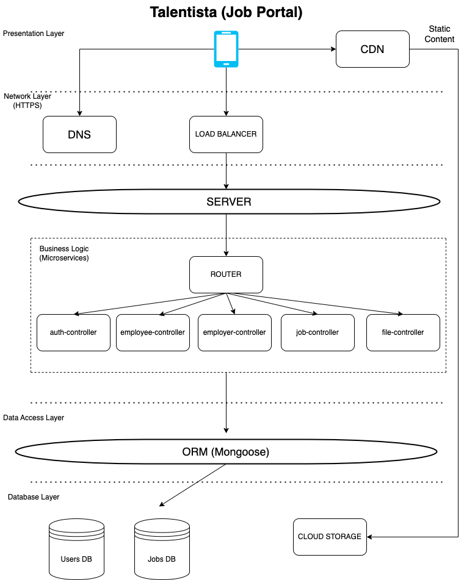

## App screenshots

  

    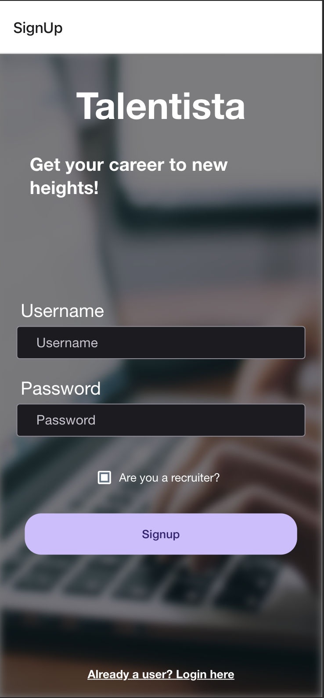
  

  

    
  

  

    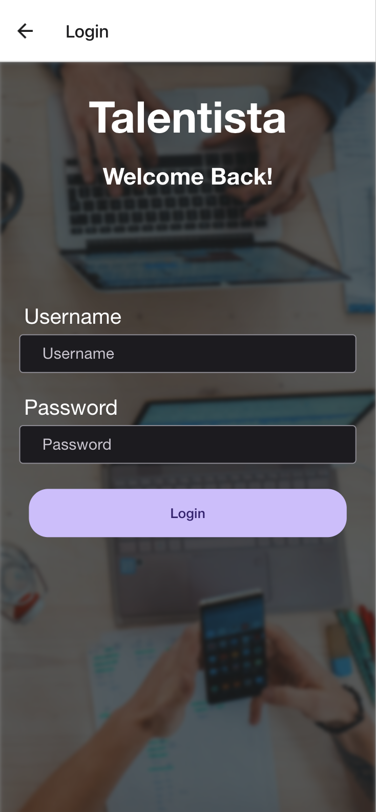
  

  

    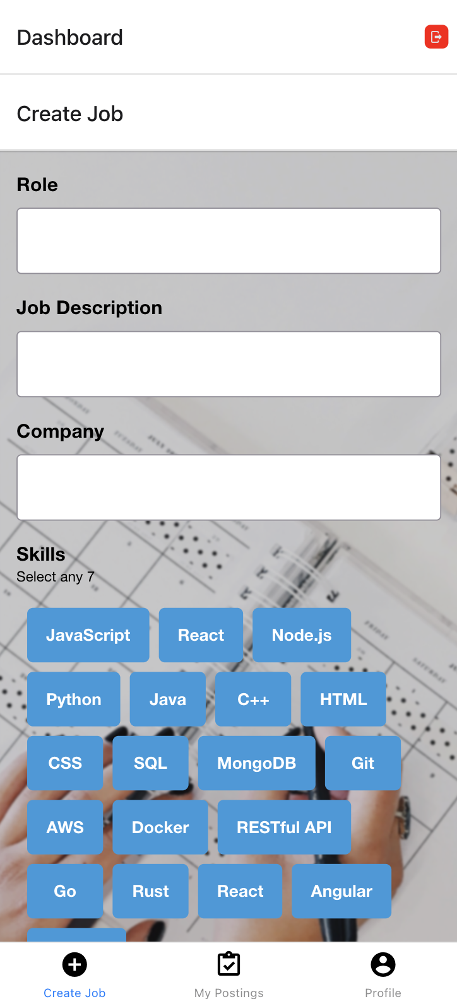
  

  

    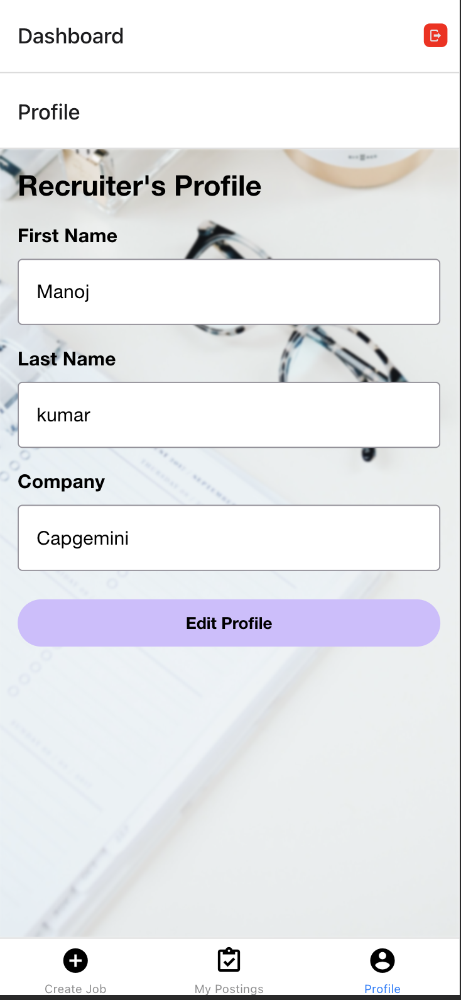
  

  

    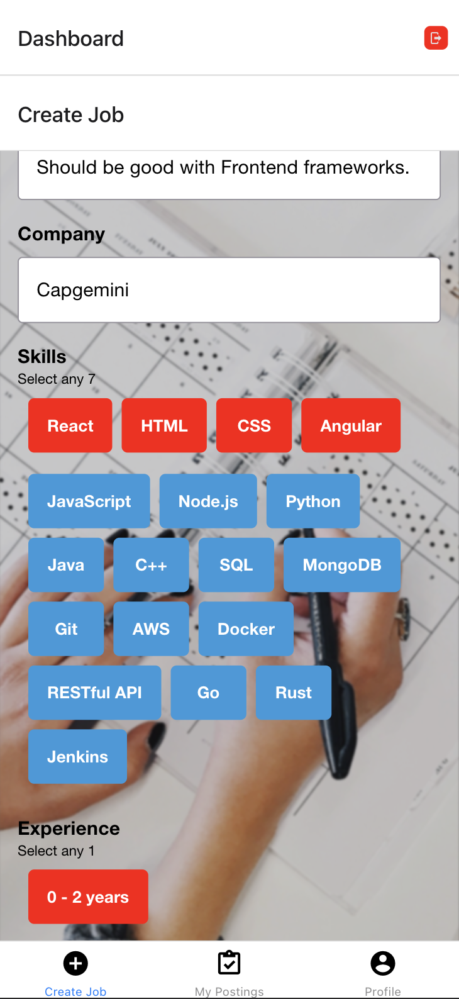
  

  

    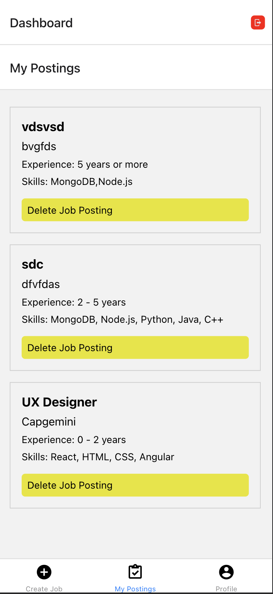
  

  

    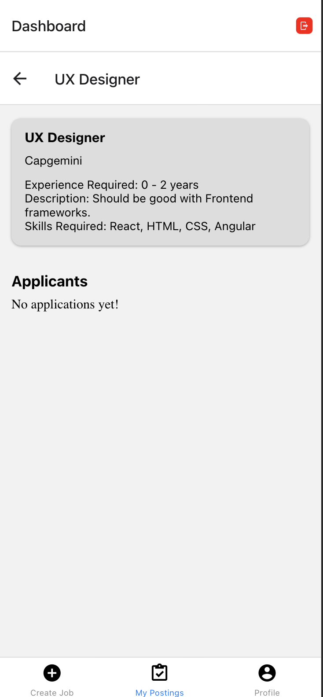
  

  

    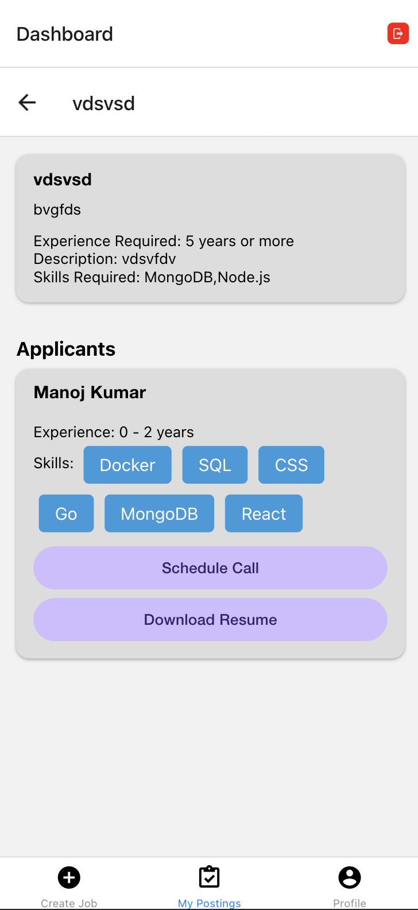
  

  

    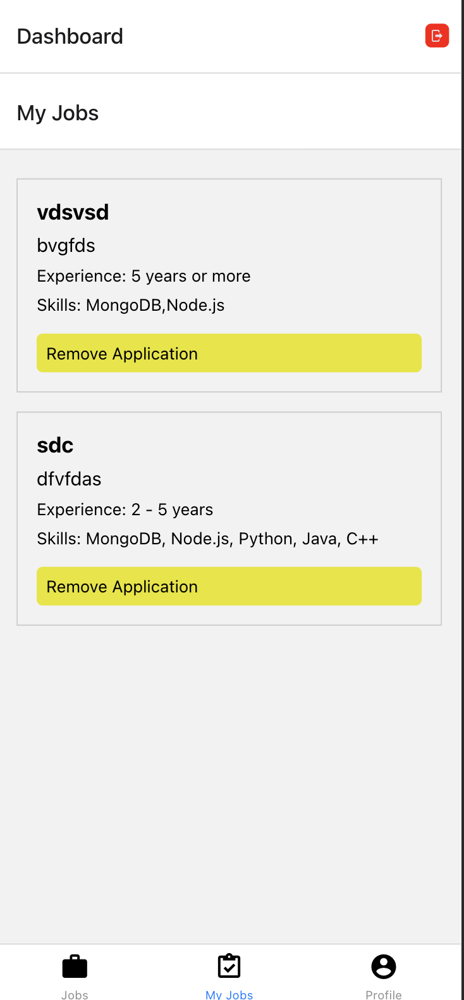
  

  

    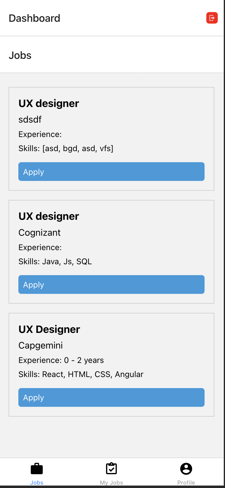
  

